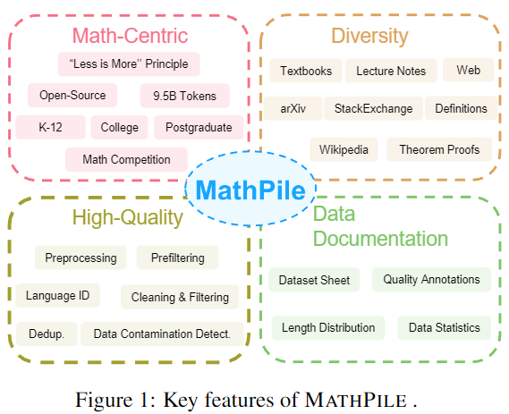
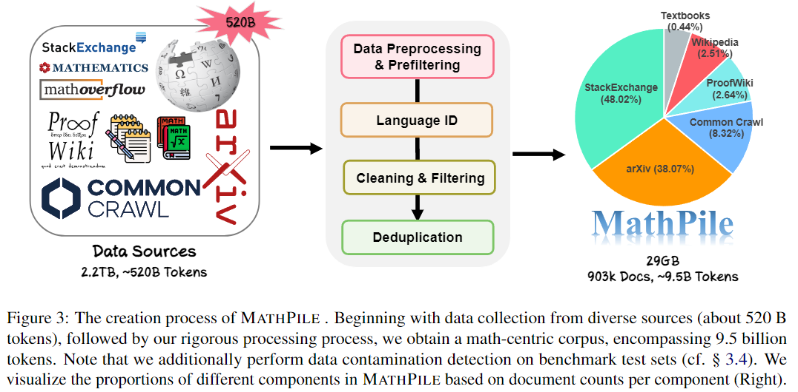

# Generative AI for Math: *MathPile*

This is the official repository for [Generative AI for Math: Part I - MathPile: A Billion-Token-Scale Pretraining Corpus for Math]()

[**Homepage**](https://gair-nlp.github.io/MathPile/) |
[**Datasets**](https://huggingface.co/datasets/GAIR/MathPile) | 
[**Paper**]() | 
[**Limitations**](https://github.com/GAIR-NLP/MathPile?tab=readme-ov-file#limitations) |
[**Statement & License**](https://github.com/GAIR-NLP/MathPile?tab=readme-ov-file#statements--license) |
[**Citation**](https://github.com/GAIR-NLP/MathPile?tab=readme-ov-file#citation) 

> Please be aware that our corpus could be updated (we will notify upon release). It is advisable to use the latest version.

## 🔥News

- [2023/12/28] We released the [MathPile](), a 9.5B high-quality and diverse math-centric pre-training corpus.


## 🚀Introduction

High-quality, large-scale corpora are the cornerstone of building powerful foundation models. In this work, we introduce **MathPile** a diverse and high-quality math-centric corpus comprising about 9.5 billion tokens. our work is significantly different from the previous work in the following characteristics:


<div align="center">
<!--  -->
  
</div>


- **Math-centric**: MathPile uniquely caters to the math domain, unlike general domain-focused corpora like Pile and RedPajama, or multilingual-focused ones like ROOTS and The Stack. While there are math-centric corpora, they're often either closed-sourced, like Google's Minerva and OpenAI's MathMix, or lack diversity, such as ProofPile and OpenWebMath.

- **Diversity**: MathPile draws from a wide range of sources: **Textbooks** (including lecture notes), **arXiv**, **Wikipedia**, **ProofWiki**, **StackExchange**, and **Web Pages**. It encompasses mathematical content suitable for K-12, college, postgraduate levels, and math competitions. **This diversity is a first, especially with our release of a significant collection of high-quality textbooks (~0.19B tokens).**

- **High-Quality**: We adhered to the principle of *less is more*, firmly believing in the supremacy of data quality over quantity, even in the pre-training phase. Our meticulous data collection and processing efforts included a complex suite of preprocessing, prefiltering, cleaning, filtering, and deduplication, ensuring the high quality of our corpus.

- **Data Documentation**:  To enhance transparency, we've extensively documented MathPile. This includes a **dataset sheet** (see Table 5 in our paper) and **quality annotations** for web-sourced documents, like language identification scores and symbol-to-word ratios. This gives users flexibility to tailor the data to their needs. We've also performed **data contamination detection** to eliminate duplicates from benchmark test sets like MATH and MMLU-STEM.


<div align="center">
<!--  -->
  
</div>

<p>

We hope our MathPile can help to enhance the mathematical reasoning abilities of language models. See our paper for more technical details.


## 😋Limitations

- The decisions made during the data collection and processing phases might not always be optimal.
- Some documents in MathPile may not always be of the highest quality. We are committed to continually refining and optimizing this corpus.


## 👊Statements & License

- These invaluable corpora are the culmination of human intellect and should be utilized for the betterment of humanity, aiding in the improvement of human life. **We strongly urge all users to refrain from using our corpus for any activities that may harm national or social security or violate the law.**

- We have done our utmost to ensure the high quality and lawful use of the data. However, unforeseen issues may still arise, including but not limited to data security concerns and any risks or problems stemming from misuse. We shall not be held responsible for any such issues.


If the source data of MathPile is governed by a license more restrictive than [CC BY-NC-SA 4.0](https://creativecommons.org/licenses/by-nc-sa/4.0/deed.en), MathPile adheres to that stricter licensing. In all other cases, it operates under the [CC BY-NC-SA 4.0](https://creativecommons.org/licenses/by-nc-sa/4.0/deed.en) license. We also plan to release a commercially usable version of the dataset soon.


## 🥳Citation

If you find our work useful or use MathPile, please cite our paper:

```

```


